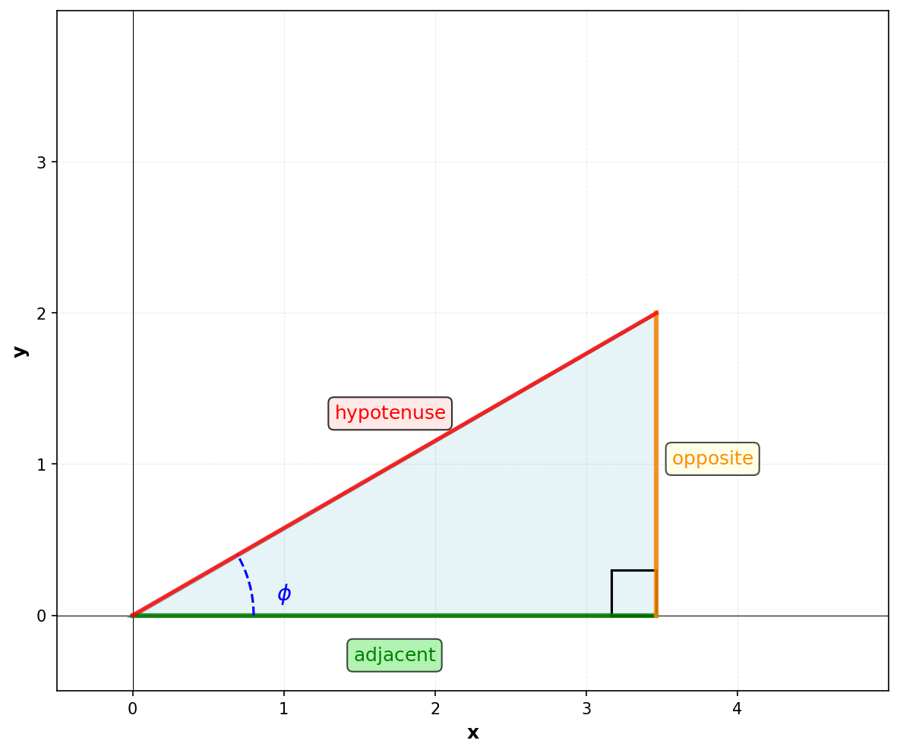

When considering the sides of a right-angled triangle, we can use trigonometric functions to relate the angles to the lengths of the sides to each other. If we consider a right-angled triangle where the angle of interest is $\phi$, we can define the following sides:

- The side opposite the angle $\phi$ is called the **opposite** side.
- The side adjacent to the angle $\phi$ is called the **adjacent** side.
- The side opposite the right angle is called the **hypotenuse**

The following trigonometric functions can be defined in terms of the sides of the triangle:

$$
\sin \phi = \frac{\text{opposite}}{\text{hypotenuse}}\\
\cos \phi = \frac{\text{adjacent}}{\text{hypotenuse}}\\
\tan \phi = \frac{\text{opposite}}{\text{adjacent}}
$$

If we know the lengths of two sides of a right-angled triangle, or the length of one side and the angle $\phi$, we can use these formulas to calculate the lengths of the other sides using these trigonometric functions.